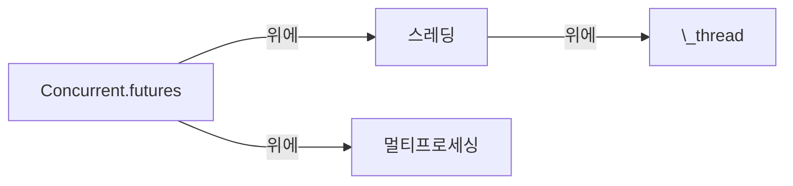

$...\$: 안에 수학 표현식을 넣어보세요!

\\(\LaTeX{}\\)

$\Pi$

$ a * b = c ^ b $

$ 2^{\frac{n-1}{3}} $

$ \int\_a^b f(x)\,dx. $

\\( \int\_a^b f(x)\,dx. \\)

$$
\begin{cases}
\text{if true}\ foo \\
\text{if false}\ bar
\end{cases}
$$

$ \rho {\rm{FOD}} = \sum\limits{\sigma ,i} {(\delta _1 - \delta _2 n_i^\sigma )|\phi _i^\sigma ({\bf{r}})|^2} $

$$ \rho {\rm{FOD}} = \sum\limits{\sigma ,i} {(\delta _1 - \delta _2 n_i^\sigma )|\phi _i^\sigma ({\bf{r}})|^2} $$

{{ "여기 liquid filter가 있습니다!" | capitalize }}
<!-- capitalize는 첫글자를 대문자로 변환해주지만 한국어라 ㅎㅎ-->


\`escape inline code\`  
`inline code`  
여기 **캡쳐 블록** 있어욤.


{{ test | markdownify }}

 
100 / 3 = {{ x }}

:+1:
:bolivia:

<!-- 이건 앞에 숫자쓸 때 꼼수 -->
\1. 21312  
\2. 21312  
\4. 4214  

## 테이블

|:                        |:                  :|: $$O_3 + C_2H_2 \rightarrow $$         :|||:  $$O_3 + C_2H_4 \rightarrow $$ :|||:       :| 
|:  ^^ Method            :| ^^ $$\lambda^a$$  |    vdW |    TS |    cycloadd.           |  vdW  |  TS  |  cycloadd.           | ^^ MAE    |
|-------------------------|-------------------|--------|-------|------------------------|-------|------|----------------------|-----------|
| $$\lambda$$-tPBE        |   0.20            | -0.40  | 7.69  | -68.00                 | -1.86 | 4.87 | -57.57               | 1.29      |
|-------------------------|-------------------|--------|-------|------------------------|-------|------|----------------------|-----------|
| MC1H-PBE $$^b$$         |   0.25            | -1.08  | 3.66  | -70.97                 | -1.25 | 0.13 | -61.26               | 3.35      |
|-------------------------|-------------------|--------|-------|------------------------|-------|------|----------------------|-----------|
| 참조값 $$^c$$ |   ---------       | -1.90  | 7.74  | -63.80                 | -1.94 | 3.37 | -57.15               | --------- |
|=========================|===================|========|=======|========================|=======|======|======================|===========|
| $$^a$$ The optimal mixing parameter.$$\~$$ $$^b$$ Ref 에서 .$$\~$$  $$^c$$ 참조에 따른 최고의 추정치. . ||||||||

|   1   |  2     |   3   |   4   |  5   |  6   |  7  |
| spancell1     ||   spancell2  || cell | spancell3 ||
|^^ spancell1   ||   spancell2  || cell | spancell3 ||
{:class="custom-table"}

|:-----:|:-----:|:-----:|:-----:| ---- |
| (0,0) | (0,1) | (0,2) | (0,3) |      |
|     (1,0)    || ^^    | (1,3) |      |

|:-----:|:-----:|:-----:|:-----:| ---- |
| (0,0) | (0,1) | (0,2) | (0,3) |      |
|     (1,0)           ||| (1,3)       ||

|:-----:|:-----:|:-----:|:-----:| ---- |
| (0,0) | (0,1) | (0,2) | (0,3) |      |
|     (1,0)           ||| ^^    |      |

<!-- 2번째 줄 마지막이 \ 역슬래쉬라는 디테일 -->
|:-----:|:-----:|:-----:|:-----:| ---- |
| (0,0) | (0,1) | (0,2) | (0,3) |      \
|     (1,0)           ||| ^^    |      |

| Stage | Direct Products | ATP Yields |
| ----: | --------------: | ---------: |
|Glycolysis | 2 ATP                   ||
|^^         | 2 NADH      | 3--5 ATP   |
|Pyruvaye oxidation | 2 NADH | 5 ATP   |
|Citric acid cycle  | 2 ATP           ||
|^^                 | 6 NADH | 15 ATP  |
|^^                 | 2 FADH | 3 ATP   |
|                        30--32 ATP  |||

{:color-style: style="background: black;" }
{:color-style: style="color: white;" }
{:font-style: style="font-weight: 900; text-decoration: underline;" }

|:                     이건 인라인 속성 목록의 예입니다!                 :||||
| ------- | ------------------------- | -------------------- | ----------- |
|:       :|:  
 &lt; 일반적인 HTML 블록 > 
 :|||
| ^^      |   Red    {: .cls style="background: orange" }                |||
| ^^ IALs |   Green  {: #id style="background: green; color: white" }    |||
| ^^      |   Blue   {: style="background: blue; color: white" }         |||
| ^^      |   Black  {: color-style font-style}                          |||

[cell image]: https://jekyllrb.com/img/octojekyll.png "모범적인 이미지!"

| 제목            | 행1      | 행2                           |
|--------------------|---------------|------------------------------------|
| 열 1              | 사과[^1]     | [Youtube (Home)]                   |
| 열 2              | 바나나        | [Github][1]                        |
| 열 3 (merged)     | 블루베리     | [Google] *****  [Github]           |
| ^^         | [자두](https://example.com) | 라즈베리 ![example][cell image]   |
| 열 4      | <https://www.google.com>    |  [테스트](https://www.google.com){:target="_blank"}                            |
|^^          |^^ <https://www.youtube.com> |                              |
| 열 5      | <https://www.google.com>                                  ||

[Youtube (Home)]: https://www.youtube.com
[Google]: https://www.google.com
[Github]: https://www.github.com
[1]: https://www.github.com
[^1]: Footnote

<https://www.google.com>

테이블에 없음: `<Mail Gateway>`

9 \* 9

| 1 \* 1 = 1 |
| 1 \* 2 = 2 | 2 \* 2 = 4 |
| 1 \* 3 = 3 | 2 \* 3 = 6 | 3 \* 3 = 9  |
| 1 \* 3 = 3 | 2 \* 3 = 6 | 3 \* 4 = 12 | 4 \* 4 = 16 |

## 이모티콘
이모티콘은 ':' 를 단어 양옆에 넣습니다!
:+1:

## PlantUML(다이어그램 언어)

@startuml
나 -> 누군가 : 안뇽
@enduml

## Mermaid(다이어그램 언어)

## 동영상

[\[비디오 링크\]](//www.youtube.com/watch?v=Ptk_1Dc2iPY)

## 음악(가능한 오디오파일)

[HTML5 오디오 포멧 테스트](https://hpr.dogphilosophy.net/test/)

"MP3" file (".mp3") :

WebMv2 Audio (".webm"):

Ogg Vorbis (".ogg") :

"wave" file(".wav") :

Spotify 팟캐스트:

## 특별 미디어 링크

로컬 동영상 파일 (".webm")

썸네일 지정해둔 동영상

Tips:

* 파이프 (`|`) 를 사용하여 열을 구분하고, 대시(`-`)들을 사용하여 헤더 행과 나머지 표의 부분을 구분합니다
* markdown 프로세서에 간격은 중요하지 않습니다. 여분의 공백은 제거되지만, 가독성에 정말 도움이 될 수 있습니다.  

아래 두 개의 마크다운 예제는 모두 이 표를 만듭니다.

파이프 `(`|`)` 를 사용하여 열을 구분하고, 대시 을 사용하여 헤더 행과 나머지 표의 부분을 구분합니다
